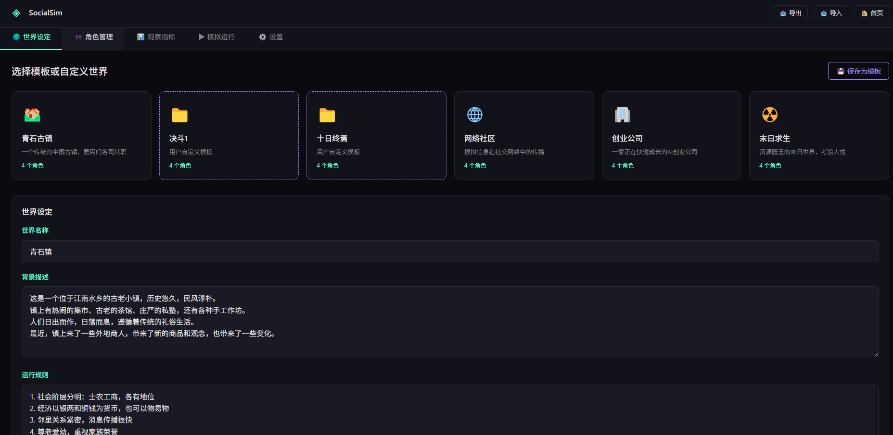
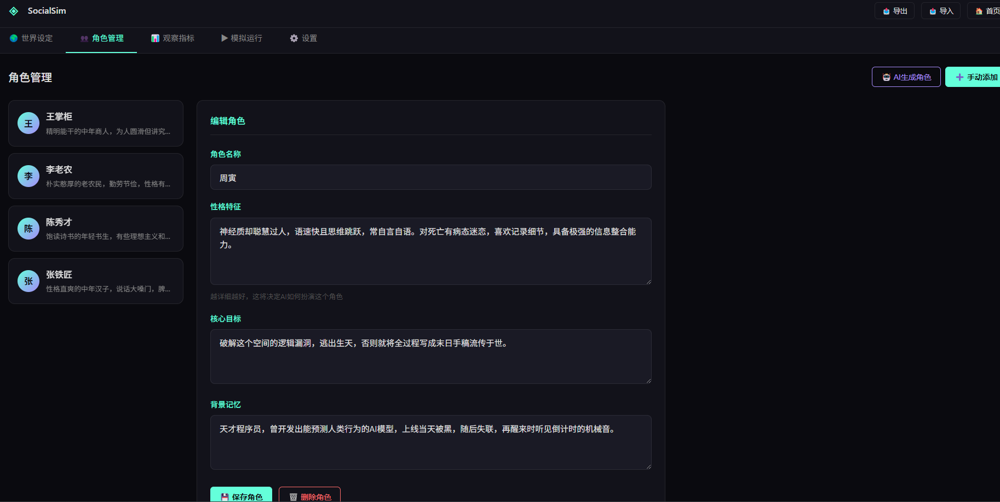
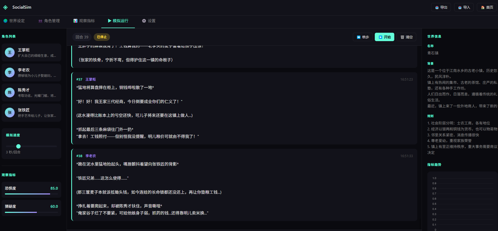
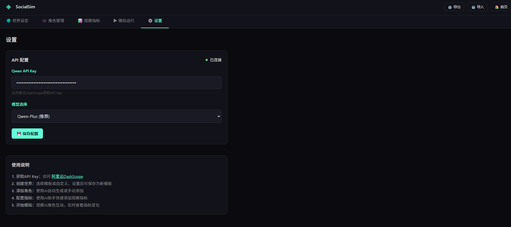

# SocialSim - AI Social Simulation Platform
SocialSim: An interactive AI-powered sandbox for simulating and observing complex social dynamics. Create custom worlds, populate them with LLM-driven agents, and watch emergent behaviors unfold in real-time.
SocialSim is an advanced AI-powered social simulation sandbox that allows you to create virtual worlds, populate them with AI-driven agents, and observe the emergence of complex social dynamics. From economic games to cultural evolution, explore infinite possibilities of social interaction and behavior patterns.
SocialSim is an advanced AI-powered social simulation sandbox that allows you to create virtual worlds, populate them with AI-driven agents, and observe the emergence of complex social dynamics. From economic games to cultural evolution, explore infinite possibilities of social interaction and behavior patterns.
# SocialSim - AI Social Simulation Platform


SocialSim is an advanced AI-powered social simulation sandbox that allows you to create virtual worlds, populate them with AI-driven agents, and observe the emergence of complex social dynamics. From economic games to cultural evolution, explore infinite possibilities of social interaction and behavior patterns.

## 🌟 Key Features

- **World Building**: Create custom virtual worlds with unique backgrounds, rules, and resource systems
- **AI Agent Generation**: Automatically generate contextually appropriate AI characters with distinct personalities, goals, and memories
- **Custom Metrics**: Define and track custom observation metrics to measure social dynamics
- **Event Injection**: Intervene in simulations by injecting unexpected events to observe responses
- **Real-time Analytics**: Visualize simulation progress and metric changes with interactive charts
- **Template System**: Save and load simulation templates for different scenarios
- **Data Import/Export**: Export your simulation data for further analysis
- **Customizable AI**: Configure different Qwen AI models for simulation

- Get your API key via this referral link: [Aliyun DashScope Benefit Page](https://www.aliyun.com/benefit?userCode=hspyk6hk)
   - Using this link supports the project author with a small referral reward – thank you!

## 🖼️ Screenshots

### 1. World Configuration Interface

This interface is used to create and customize virtual worlds. You can either use pre-built templates (e.g., Ancient Town, Startup Company) or define a completely custom world by setting its name, background story, operational rules, and core resource elements. Configured worlds can be saved as reusable templates for future experiments.

### 2. Agent Management Interface

Manage all AI agents in your simulation here. You can **automatically generate agents** that match your world settings with one click, or manually create agents by defining their personalities, core goals, and background memories. The interface supports editing, deleting, and previewing agent profiles to ensure each character has unique traits.

### 3. Metric Configuration Interface

Define custom observation metrics to track social dynamics during simulation. Use the AI assistant to generate metrics based on your description (e.g., "group cohesion", "resource distribution fairness"), or manually set metrics with specific value ranges and units. These metrics will be analyzed in real-time during the simulation.

### 4. Simulation Running Interface

The core interface for running and monitoring simulations. You can adjust simulation speed, start/stop auto-run, or execute step-by-step simulation. View real-time interactions between agents, inject custom events (e.g., natural disasters, resource shortages) to test agent responses, and track metric changes with dynamic charts.

### 5. Settings Interface

Configure API connections and application preferences here. Enter your Aliyun DashScope API key to enable AI features, select the Qwen model (balanced, fast, or high-quality), and view usage instructions. The interface also shows the current API connection status for quick troubleshooting.

## 🚀 Getting Started

### Prerequisites

- Python 3.8 or higher
- A Qwen API key from Aliyun DashScope (see API Configuration section below)
- Basic knowledge of Python and web browsers

### Installation

1. Clone the repository:
```bash
git clone https://github.com/zhengxuanjiang/SocialSim-v2.1---AI-.git
cd socialsim
```

2. Install dependencies:
```bash
pip install flask openai python-dotenv
```

3. Set up your API key (two options):
   - **Option 1**: Set environment variable (Linux/macOS)
     ```bash
     export DASHSCOPE_API_KEY="your-api-key-here"
     ```
   - **Option 2**: Configure through the web interface (recommended for beginners)

4. Run the application:
```bash
python socialsim.py
```

5. Open your browser and navigate to: `http://localhost:5000`

## 📋 Usage Guide

### Basic Workflow

1. **API Configuration** (Settings tab)
   - Enter your DashScope API key (see below for how to get one)
   - Select the appropriate Qwen model (qwen-plus is recommended for balance of speed and quality)

2. **Create a World** (World tab)
   - Choose a pre-built template or create a custom world from scratch
   - Define world name, background story, operational rules, and resource systems
   - Save your world configuration for future use

3. **Add Agents** (Agents tab)
   - Generate AI agents automatically (recommended) based on your world settings
   - Or manually create agents with custom personalities, goals, and background memories
   - Edit or delete agents as needed

4. **Set Up Observation Metrics** (Metrics tab)
   - Use AI assistant to generate relevant social metrics (e.g., "group cohesion", "resource distribution fairness")
   - Or manually create custom metrics with specific value ranges
   - Define what social dynamics you want to track during simulation

5. **Run Simulation** (Simulate tab)
   - Adjust simulation speed (1-10 seconds per round)
   - Start the simulation (auto-run or step-by-step mode)
   - Inject custom events to test agent responses
   - Monitor the evolution of social dynamics and metric changes

### Advanced Features

- **Template Management**: Save your world/agent configurations as reusable templates
- **Data Export**: Export full simulation data (world settings, agent logs, metric history) for external analysis
- **Event Injection**: Test how agents respond to unexpected events (e.g., natural disasters, resource shortages)
- **Metric Visualization**: Track how social metrics change over time with interactive line charts

## 🔑 API Configuration

To use SocialSim, you need a Qwen API key from Aliyun DashScope:

1. Get your API key via this referral link: [Aliyun DashScope Benefit Page](https://www.aliyun.com/benefit?userCode=hspyk6hk)
   - Using this link supports the project author with a small referral reward – thank you!
2. Register/Login to your Aliyun account
3. Navigate to the DashScope console
4. Create and copy your API key
5. Paste it into the Settings tab of SocialSim

### Supported Qwen Models

- `qwen-plus`: Balanced performance (recommended for most use cases)
- `qwen-turbo`: Faster response speed (ideal for quick simulations)
- `qwen-max`: Highest quality responses (ideal for detailed social dynamics)

## 🔧 Technical Details

### Architecture

- **Backend**: Flask-based REST API with thread-safe simulation engine
- **Frontend**: Modern HTML/CSS/JavaScript interface with responsive design
- **AI Integration**: OpenAI-compatible interface for Qwen large language models
- **State Management**: Thread-safe simulation state with locking mechanisms to prevent race conditions
- **Data Visualization**: Chart.js integration for real-time metric tracking

### Simulation Engine

The simulation engine uses a turn-based approach where each agent takes actions based on:
- Their unique personality traits and core goals
- Memory of past interactions and events
- Current world state and available resources
- Relationships and dynamics with other agents
- Injected events and external stimuli

Each round, the AI agent generates responses following role consistency rules, ensuring natural and contextually appropriate behavior.

## 📝 License

This project is licensed under the MIT License - see the [LICENSE](LICENSE) file for details.

## 🙏 Acknowledgments

- [Aliyun DashScope](https://dashscope.console.aliyun.com/) for providing Qwen LLM API access
- [Flask](https://flask.palletsprojects.com/) for the lightweight web framework
- [Chart.js](https://www.chartjs.org/) for intuitive data visualization
- All contributors and users who help improve this project

## 📞 Support

If you encounter any issues or have questions:
- Open an issue on the GitHub repository
- Check the "Usage Guide" section for common workflows
- Verify your API key configuration if AI features aren't working

## 📈 Roadmap

Planned features for future releases:
- [ ] Multi-language interface support (Chinese/English)
- [ ] Advanced agent memory system with long-term context retention
- [ ] Network visualization of agent social relationships and interaction networks
- [ ] More statistical analysis tools for simulation data (e.g., correlation analysis)
- [ ] Batch simulation and comparison features for scenario testing
- [ ] Docker containerization for easier deployment and cross-platform use
- [ ] Cloud deployment support with remote simulation monitoring
- [ ] Enhanced agent interaction rules with more realistic social behaviors

---

Made with ❤️ for social science research and AI experimentation  
If you find this project useful, please star the repository ⭐
